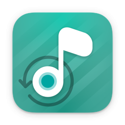
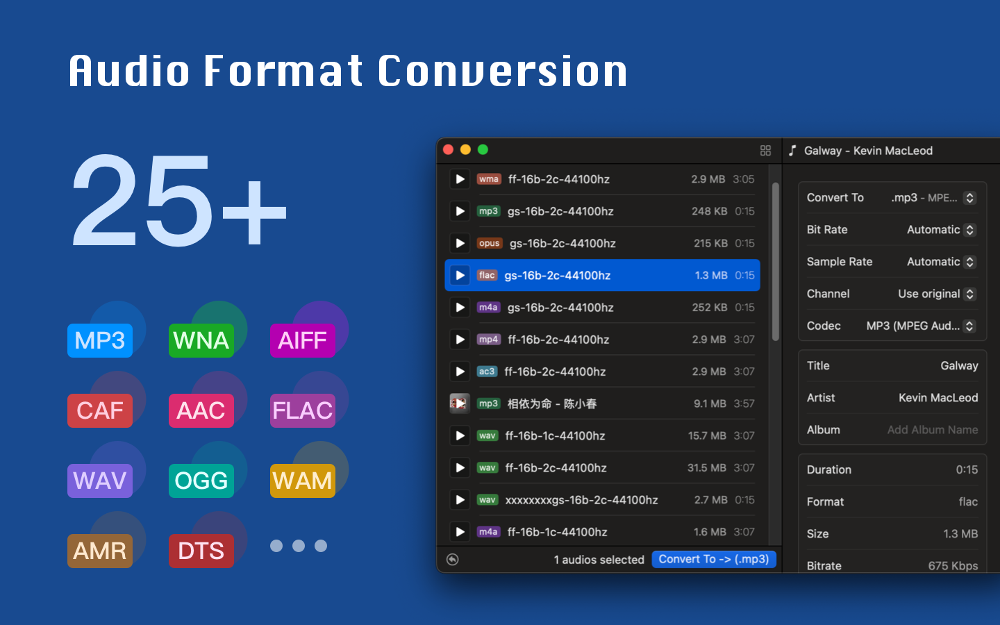
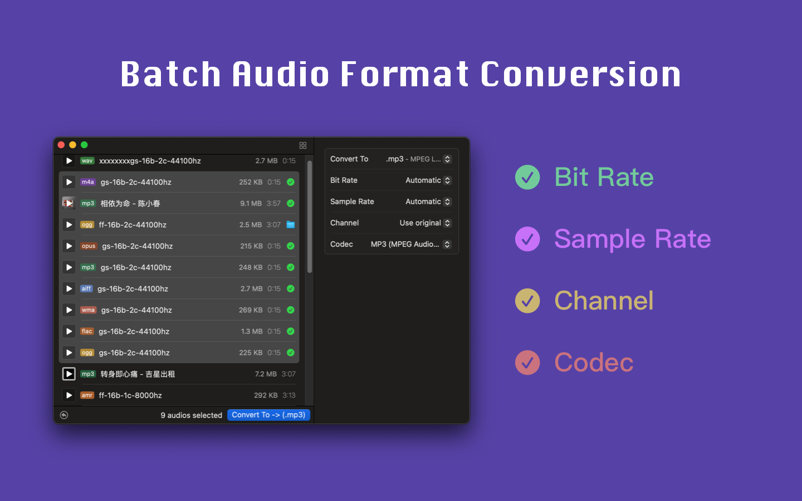
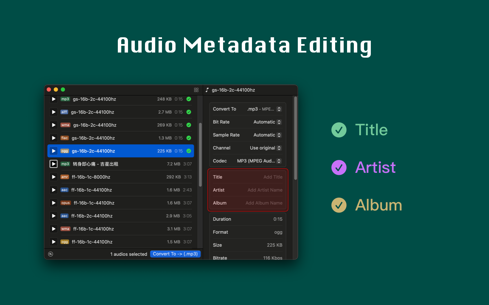

<!--idoc:ignore:start-->
> [!TIP]
> Declaration: This project is not an open-source project. The repository serves as the official website, used to collect issues and user demands. This is done to save costs, because without an official website, the application cannot pass the review.
<!--idoc:ignore:end-->

   
   
  
  <h1>
    Audioer
  </h1>
  <!--rehype:style=border: 0;-->
  

    <a href="./README.zh.md">简体中文</a> • 
    <a target="_blank" href="https://github.com/jaywcjlove/Audioer/issues/new?template=bug_report.yml">Contact & Support</a> • 
    <a href="./CHANGELOG.md">Changelog</a>
  

  

    
  

Easily convert all audio files to MP3 with just one click! It supports conversion between multiple audio formats with simple and fast operation. Just drag the files into the application window, adjust the settings, click the button, and the conversion is done!

Supported audio formats include: `.aac`, `.ac3`, `.aifc`, `.aiff`, `.aif`, `.amr`, `.au`, `.caf`, `.dts`, `.eac3`, `.flac`, `.m4a`, `.mp2`, `.mp3`, `.mp4`, `.mka`, `.mov`, `.ogg`, `.opus`, `.ra`, `.rm`, `.spx`, `.tta`, `.voc`, `.vob`, `.wav`, `.webm`, `.wma`, `.w64`, `.m4r`

### Key Features

- **Audio Bitrate Adjustment**: Customize the bitrate to ensure the audio quality meets your needs.  
- **Sample Rate Detection**: Automatically detect and adapt the audio sample rate.  
- **Audio Channel Settings**: Easily adjust the number of audio channels.  
- **Audio Metadata Editing**: Edit metadata such as artist, album, and more, making it easy to organize and manage your audio files.  
- **Simple Operation**: Complete format conversion quickly with just two clicks.  

Our application supports almost all common audio formats across various devices — making music conversion and metadata editing easier than ever!
