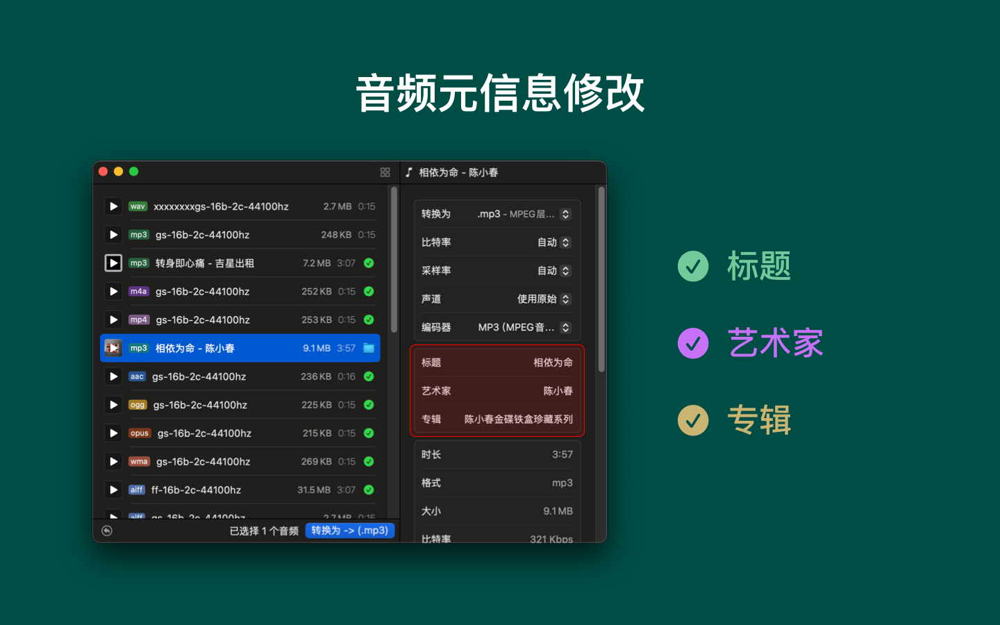

<!--idoc:ignore:start-->
> [!TIP]
> 声明：此项目并非开源项目，仓库作为官方网站，用于收集问题和用户需求。这样做是为了节省成本，因为没有官网，应用无法通过审核。
<!--idoc:ignore:end-->

   
   
  
  <h1>
    Audioer
  </h1>
  <!--rehype:style=border: 0;-->
  

    <a href="./README.zh.md">简体中文</a> • 
    <a target="_blank" href="https://github.com/jaywcjlove/Audioer/issues/new?template=bug_report_cn.yml">联系&支持</a> • 
    <a href="./CHANGELOG.zh.md">更新日志</a>
  

  

    
  

一键将所有音频文件转换为 MP3 格式！支持多种音频格式之间的相互转换，操作简单，转换便捷。只需将文件拖入应用窗口，调整设置后点击按钮，即可轻松完成转换！

支持转换的音频格式包括：`.aac`、`.ac3`、`.aifc`、`.aiff`、`.aif`、`.amr`、`.au`、`.caf`、`.dts`、`.eac3`、`.flac`、`.m4a`、`.mp2`、`.mp3`、`.mp4`、`.mka`、`.mov`、`.ogg`、`.opus`、`.ra`、`.rm`、`.spx`、`.tta`、`.voc`、`.vob`、`.wav`、`.webm`、`.wma`、`w64`、`m4r`

### 主要功能

- 音频比特率调整：支持自定义比特率，确保音质符合需求。  
- 采样率检测：自动检测并适配音频采样率。  
- 音频通道设置：轻松调整音频的声道数。  
- 音频元信息修改：支持编辑音频文件的 元数据，如歌手、专辑等信息，方便整理和管理你的音频文件。  
- 简便操作：只需2步点击，快速完成格式转换。  

我们的应用程序支持几乎所有设备常见的音频格式，转换音乐与编辑元信息从未如此简单！

